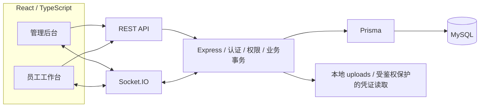
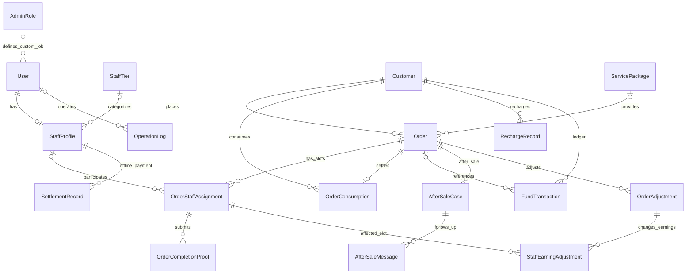
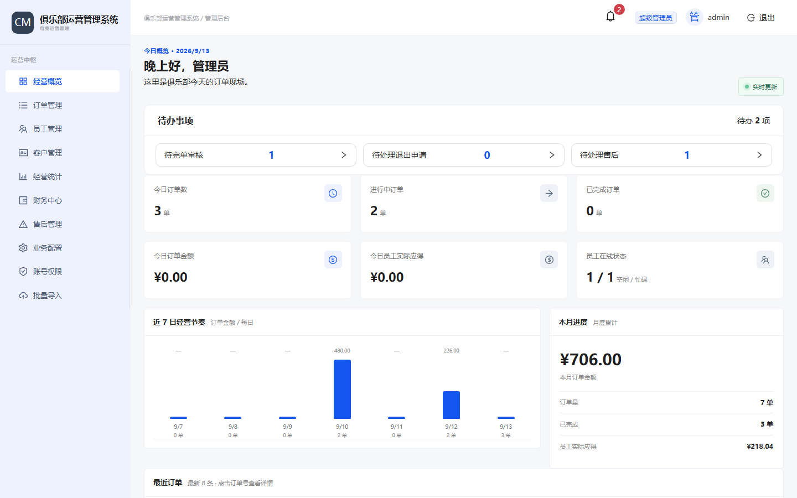
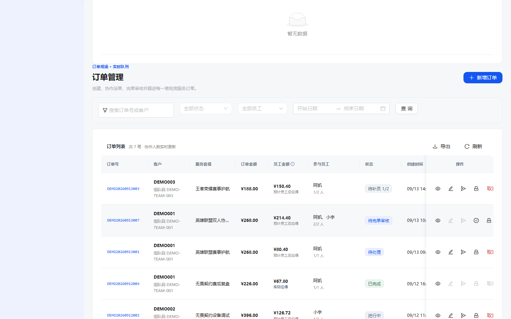
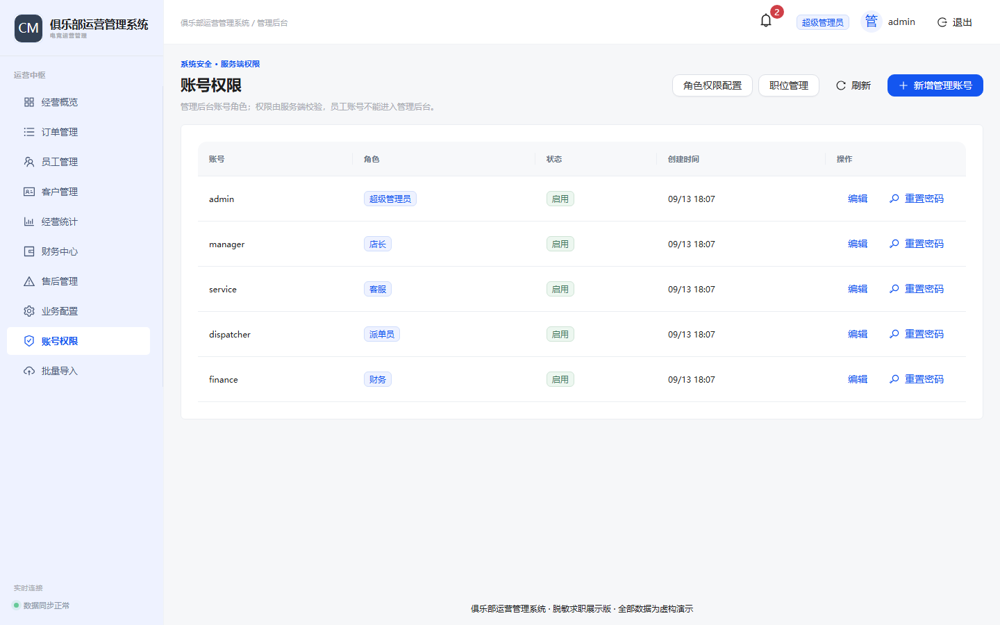
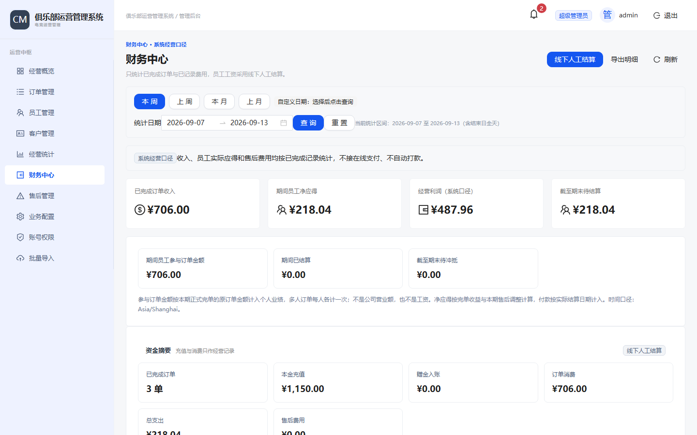
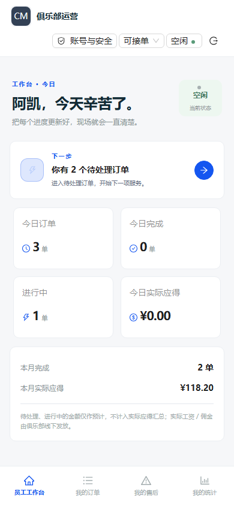

# 俱乐部运营管理系统 · 求职展示版

## 项目简介

这是一个**真实客户项目的脱敏求职展示版本**。原系统已完成开发、真实环境测试、验收与交付；本仓库保留原项目的 React 前端、Express 后端、Prisma 数据模型、migration 和回归脚本，移除客户身份、品牌、生产配置与业务数据。

这里的页面和业务流程来自真实实现。`server/seed.ts` 仅为本地查看提供虚构数据，未另做一套替代业务系统的 Demo。

建议先看 [订单页面](src/pages/admin/OrdersPage.tsx)、[订单与结算接口](server/routes.ts)、[数据库模型](prisma/schema.prisma)，再运行下面的 smoke，观察完整业务链。

## 项目背景

系统面向俱乐部内部运营，覆盖管理后台与员工工作台。需要解决的问题包括：订单由谁参与、多人名额如何补齐、谁能看客户信息、何时允许开始与结算，以及售后如何同时影响客户余额和员工收益。

项目包含订单、员工、客户、业务配置、权限、售后和财务等模块。余额与员工结算记录用于内部经营管理；**没有接入在线支付、自动打款或游戏内操作**。

## 我的职责

本人负责客户需求沟通、业务规则拆解、任务规划、AI 辅助工程实现组织、真实环境测试、验收和交付推进。**Codex 作为编码协作者参与具体工程实现。**

本项目不声称“全部代码纯手写”。我需要能够解释业务约束、判断实现是否满足需求、复现失败场景，并对验收与交付结果负责。下文以仓库中的真实代码和测试为依据，不宣称不存在的覆盖率、用户量或性能指标。

## 技术栈

| 层次 | 实际使用 |
|---|---|
| 前端 | React、TypeScript、Vite、React Router、Ant Design |
| 后端 | Node.js、Express、TypeScript、Zod |
| 数据层 | Prisma、MySQL；金额使用整数分，比例使用基点 |
| 实时通信 | Socket.IO |
| 认证 | JWT、bcryptjs、用户认证版本校验 |
| 导入导出 | ExcelJS |
| 验证 | Node.js assert、接口流程脚本、Playwright |
| 部署结构 | 前端静态文件 / Express 进程 / MySQL；提供 Nginx、PM2 模板 |

依赖的实际版本以 [package.json](package.json) 与 [package-lock.json](package-lock.json) 为准。本地验证使用 Node.js 24 和 MySQL 8.4。

## 系统架构



这是一个单体工程，前后端分别编译，不是微服务。主要业务路由仍集中在 `server/routes.ts`，财务、权限、提醒、安全删除等逻辑有独立模块。本展示版保留这一真实工程形态，没有为求职展示重新拆层或重构业务。

```text
src/
  pages/admin/          管理后台页面
  pages/workbench/      员工工作台页面
  components/           名额操作、权限、财务、提醒等组件
  auth-storage.ts       管理端 / 员工端登录信息隔离
  realtime.ts           页面实时刷新订阅
server/
  routes.ts             订单、客户、员工、完单、售后等接口
  auth.ts               JWT / 密码哈希 / HTTP 鉴权
  admin-roles.ts        自定义职位及授权边界
  role-permissions.ts   权限键、默认模板、层级限制
  delete-order.ts       删除前校验与账务逆向事务
  earnings.ts           原收益与差额调整口径
  staff-presence.ts     工作台连接的在线状态
  seed.ts               脱敏后的本地演示初始化
prisma/
  schema.prisma         当前完整数据模型
  migrations/           9 个真实结构演进 migration
scripts/                原有回归脚本及展示版运行入口
deploy/                 通用部署模板、本地测试库初始化
docs/screenshots/       真实运行的脱敏界面截图与说明
uploads/                本地运行生成，业务文件不纳入 Git
```

## 核心业务

### 一单多人、坑位与派单

`Order.requiredStaffCount` 定义所需人数，`OrderStaffAssignment` 定义每个服务名额的员工、提成、开始/退出与完单状态。

- 创建订单可以预分配 0～N 人，按选择顺序绑定对应名额；未占用名额继续进入接单池。
- 管理员手动派单与员工抢单使用同一套 assignment 规则。
- 最后名额的竞争由订单行锁及事务控制；重复接单不会让同一员工占据两个有效名额。
- 开始前可以退出并释放名额；开始后退出需要审核，再走原有补位流程。
- 退出的 assignment 保留历史，新一轮占用有自己的记录。业务按当前有效名额计算，不把历史退出记录重复计入人数。

### 状态流转与多人完单

| 状态 | 关键约束 |
|---|---|
| 待接单 / 待补员 | 0/N 或部分名额已占用；“待补员”为已有模型上的显示状态 |
| 待处理 | 人员已满，尚未开始 |
| 进行中 | 满员后开始；参与员工提交自己的凭证 |
| 待完单审核 | 所有应提交员工完成提交，交管理端审核 |
| 已完成 | 审核通过后在事务中扣款、写消费与流水、确认员工收益 |

凭证记录关联订单、员工和 assignment。审核退回后可重新提交；余额不足时不能只完成订单而漏掉扣款。具体约束见 `server/routes.ts` 中 completion-submissions、completion-review 及结算事务。

### 余额、流水、售后差额

客户本金与赠金分开记录，消费保留实际使用的本金/赠金以及变更前后余额。保留 `ConsumptionRecord` 兼容历史结构，当前精确消费来源为 `OrderConsumption`。

售后调整采用**原始结算 + 差额记录**，通过 `OrderAdjustment`、`StaffEarningAdjustment` 和 `FundTransaction` 联动客户余额、订单净额与员工净收益。已经登记的结算记录与待结算、待冲抵采用统一计算口径。

参与订单金额不等于员工工资。员工实际应得取决于名额的实际收益与后续差额；线下人工结算是单独记录。

### 权限隔离与受控删除

前端按权限提供入口，后端继续独立校验。员工只能读取自己作为有效参与者应有的客户信息，不应通过接单池看到完整客户资料或其他员工收益。

安全删除仅允许超级管理员，要求输入订单号确认。在账务能够安全逆向时恢复原消费拆分和相关收益；无法明确还原的情况拒绝删除。`SettlementRecord` 没有订单外键，因此对涉及已结算收益的删除采取保守限制，并不声称能够自动拆解任意历史结算。

## 实时通信

Socket.IO 主要承担**变化通知**，不把所有业务数据直接广播给所有连接。

- 后端通过 `server/realtime.ts` 的 `data:changed` 通知管理端及相关员工房间。
- 页面收到通知后重新请求 REST API，使用当时的真实权限读取订单、财务、工作量和待办。
- 重连后重新加载，避免断线期间漏掉状态变化。
- 员工在线状态按稳定 `userId` 与有效工作台连接维护；管理端连接不算员工上线。
- 密码修改/重置后递增 `User.authVersion`，HTTP 和 Socket.IO 都校验版本，已有旧连接也会断开。

当前 presence 与旧连接撤销按**单个 Node/PM2 fork 进程**实现。若将来采用多实例部署，需要补充共享通信与在线状态方案；本仓库没有 Redis 分布式在线系统。

## 权限设计

| 身份 | 实际边界 |
|---|---|
| SUPER_ADMIN | 全部权限、管理层级最高；超级管理员自身权限不作为普通模板编辑 |
| STORE_MANAGER | 默认日常经营权限较完整；可按后端范围配置/管理下级岗位，不能控制超级管理员或提升为更高身份 |
| 客服 / 派单员 / 财务 | 默认权限模板可由上级调整，不把岗位名称等同于固定能力 |
| CUSTOM_ADMIN | 账号关联 `AdminRole`，按自定义职位的勾选权限执行，保留不可下放的安全边界 |
| STAFF | 员工工作台、自身账号操作与自身参与业务，不具备后台岗位管理权 |

实现依据：`server/auth.ts`、`server/role-permissions.ts`、`server/admin-roles.ts`。管理端与员工端的浏览器存储分开；JWT 关联用户 id 和认证版本，而不是以 username 作为业务外键。权限不是只靠菜单隐藏实现。

## 数据模型

以下是当前 schema 的核心关系摘要，并非全部表。字段与删除约束以 `prisma/schema.prisma` 为准。



## 项目截图

截图目录为 [docs/screenshots](docs/screenshots/README.md)。原项目截图包含客户品牌和历史环境信息，未直接纳入。仅收录这份展示版实际启动后的浏览器截图，使用 seed 的虚构数据，不展示客户原始数据、生产域名或登录密码。

| 管理后台首页 | 多人订单与状态 |
|---|---|
|  |  |
| 账号与角色 | 财务口径 |
|  |  |

员工手机工作台（390 × 844）：



## 本地运行

### 准备环境

- Node.js 24、npm。
- Docker / Docker Compose 已启动，用于本地 MySQL 8.4；也可使用下述手动 MySQL 方式。
- 空闲端口：展示 API `4200`、前端 `5175`、MySQL `13316`；回归测试使用 `4210` / `8280`。

以下命令均在仓库根目录执行。未配置 GitHub remote，不需要客户服务器或云账号。

```bash
npm ci
npm run demo:setup
npm run db:start
npm run db:status
npm run db:generate
npm run db:migrate
npm run db:seed
```

等待 MySQL 显示 healthy 后再执行 migration。`demo:setup` 根据 `.env.example` 在仓库外的同级目录新建 `.club-management-showcase.local.env`，随机生成**本机专用**数据库密码与 JWT secret，不覆盖已有本地配置，也不打印生成值。代码仓库不包含这些生成值。启动、数据库和测试脚本自动读取该文件；也可通过 `SHOWCASE_ENV_FILE` 指定个人配置路径。请勿将该外部文件复制到仓库。

`db:seed` 仅允许本机的 `club_management_showcase` / `club_management_showcase_test`，且拒绝已有账号的数据库。它不清库、不覆盖已有账号；已经初始化后无须重复 seed。所有演示账号、客户、订单、账务与凭证均是虚构数据。

两个终端分别运行：

```bash
# 终端 1：后端
npm run dev:server
```

```bash
# 终端 2：前端
npm run dev:client
```

也可运行 `npm run dev` 同时启动开发服务。浏览器访问：

- 管理后台：<http://127.0.0.1:5175/admin/login>
- 员工工作台：<http://127.0.0.1:5175/workbench/login>
- 健康检查：<http://127.0.0.1:4200/api/health>

公开演示账号（仅用于本地，**不是生产凭据**）：

| 入口 | 账号 | 演示密码 |
|---|---|---|
| 超级管理员 | `admin` | `Demo-Local-Only!2026` |
| 店长 / 客服 / 派单员 / 财务 | `manager` / `service` / `dispatcher` / `finance` | 同上 |
| 员工 | `lin`（阿凯）、`chen`（小宇） | 同上 |

可以在首次 seed 前通过仓库外本地配置文件的 `SEED_ADMIN_PASSWORD`、`SEED_STAFF_PASSWORD` 改为自己的演示密码。不要把本地示例账号直接用于真实营业环境。

构建并运行编译产物：

```bash
npm run build
npm run demo:start
```

`demo:start` 启动真实编译后的 Express 后端和已有本地静态代理，端口仍是 `4200` / `5175`。先停止同端口的开发服务。Nginx / PM2 通用模板保留在 `deploy/` 与 `ecosystem.config.cjs`，本地无需部署到公网。

### 使用已有的本地 MySQL

不使用 Docker 时，在你自己的 MySQL 8.4 管理会话中创建独立库和账号。下面的密码是必须替换的占位符，不是可直接使用的配置：

```sql
CREATE DATABASE club_management_showcase CHARACTER SET utf8mb4 COLLATE utf8mb4_unicode_ci;
CREATE DATABASE club_management_showcase_test CHARACTER SET utf8mb4 COLLATE utf8mb4_unicode_ci;
CREATE USER 'showcase_app'@'localhost' IDENTIFIED BY 'REPLACE_WITH_YOUR_LOCAL_PASSWORD';
GRANT ALL PRIVILEGES ON club_management_showcase.* TO 'showcase_app'@'localhost';
GRANT ALL PRIVILEGES ON club_management_showcase_test.* TO 'showcase_app'@'localhost';
```

先执行 `npm run demo:setup`，再把仓库外本地配置文件中 `DATABASE_URL` 的端口、用户名和密码改为本地值，数据库名保持上述约定。URL 中的特殊字符需要编码。然后执行 `db:generate`、`db:migrate`、`db:seed`。这些授权仅针对两个本地展示库。

## 测试

测试源于原项目已有的业务验收与回归脚本，展示版仅调整本地配置、虚构数据及运行入口。下面的测试入口自动使用独立的 `club_management_showcase_test`，不会写展示主库或生产数据库。运行前先完成上面的依赖安装、MySQL 启动及构建。

```bash
npm run lint
npm run typecheck
npm run build
npm run test:calendar
npm run test:smoke
npx playwright install chromium
npm run test:security
npm run test:collaboration
```

| 命令 | 实际脚本与检查内容 |
|---|---|
| `test:calendar` | `greeting-test.mjs`、`dispatch-calendar-test.mjs`：北京时间问候、日期范围与宿主时区边界 |
| `test:smoke` | `final-flow-test.mjs`、`feedback-flow-test.mjs`：新客户同步充值、多人接单竞争、退出补位、完单凭证/退回/重提、唯一结算、余额不足回滚、客户隐私、Excel 导入、售后及线下结算幂等 |
| `test:security` | `verify-auth-version.mjs`：员工与管理员改密/重置后的旧 HTTP/JWT 与 Socket.IO 失效、新凭据可用、username-only 行为 |
| `test:collaboration` | `verify-multi-preassign.mjs`：0～N 人预分配、slot 提成、重复/超员/不合格员工拒绝、最终名额竞争、退出与 PC/手机表单 |

还保留了动态 RBAC、自定义职位、财务、删除订单、在线状态等原专项脚本。部分历史浏览器脚本需要对应阶段测试生成的 `output/` 夹具，**不把保留脚本数量等同于全部已运行，也不虚构覆盖率**。默认验证入口以上表为准。

### 公开前 QA（2026-09-13）

| 项目 | 实测结果 |
|---|---|
| 无依赖、无 dist、无环境文件的新目录执行 `npm ci` | 通过 |
| `demo:setup` / `db:start` / `db:status` / `db:generate` | 通过 |
| 空 MySQL 库执行 9 个 migration、seed | 通过，生成 7 个虚构订单；测试库也从空库初始化 |
| README 手动 MySQL 初始化 SQL | 在另一套空 MySQL 8.4 实例执行通过 |
| `lint` / `typecheck` / `build` | 通过 |
| `test:calendar` | 问候 15 例、派单日期 8 例，分别覆盖 3 个时区 |
| `test:smoke` | 原 final-flow、feedback-flow 全部通过，含完单图片真实上传与读取 |
| `test:security` | 7 项通过 |
| `test:collaboration` | 10 项通过，PC / 390px 无横向溢出，Console 零错误断言通过 |
| 独立 `dev:server` + `dev:client`、组合 `dev`、编译后的 `demo:start` | 三种启动方式均通过管理端 / 员工端浏览器登录与页面检查，Console 零错误 |

这次验证使用当前电脑上的干净目录和独立空数据库模拟首次安装，未复用原项目的依赖、构建产物、环境文件或业务文件。为避免端口冲突，QA MySQL 使用另一个本机端口；公开默认端口仍为 `13316`。这不等于对每一种操作系统和新机器配置都做过验证。

展示版的最小兼容性修复：`Space orientation`、`Modal mask.closable`、欢迎语表单挂载后再回填；凭证读取使用已校验的上传根目录加相对路径，避免隐藏父目录导致合法图片被拒绝，原鉴权和 realpath 边界保留。测试启动等待改为有进程退出检测的 60 秒上限。

### 依赖审计与已知限制

- Prisma CLI 与 Client 从 `6.19.0` 同步升级并锁定为 `6.19.3`，其 `effect` 依赖为 `3.21.0`，修复了原 Effect 漏洞。[Prisma 官方补丁说明](https://github.com/prisma/orm/releases/tag/6.19.3)
- `npm audit` 从 **4 high 降为 3 high，0 critical**。剩余受影响包是 `prisma → @prisma/config → deepmerge-ts@7.1.5`；是一个底层漏洞向上传递，不能理解为三个独立业务漏洞。
- **`npm audit --omit=dev` 也仍报告这 3 项**，因为依赖树中的 Prisma CLI 被 Client 的 peer 关系纳入；不能把它们简单排除为“仅开发依赖”。
- DeepmergeTS 的修复版本为 `8.0.0`，其 Map 深合并、类型及输入变更行为存在破坏性变化。Prisma 6.19.3 仍固定引用 7.1.5，未强行 override，也未使用 `npm audit fix --force`。后续应等待兼容上游补丁，或另开分支评估升级及完整回归。[官方安全公告](https://github.com/RebeccaStevens/deepmerge-ts/security/advisories/GHSA-ggr8-5vv4-36mx)、[8.0.0 破坏性变更](https://github.com/RebeccaStevens/deepmerge-ts/releases/tag/v8.0.0)
- 当前业务代码没有直接调用该合并库；安装包中的调用位于 Prisma 配置读取流程。根据此调用位置判断，未发现当前 REST 输入直接进入该调用，但这不构成不可利用的证明。不要执行不可信 Prisma 配置，也不要把本地展示配置直接当生产加固方案。
- 构建仍有大于 500 kB 的主包提示，Prisma 有未来配置格式弃用提示；均已保留记录。部分上游包安装时也会提示 deprecated，未借本轮 QA 重构技术栈。

完整检查范围、暂存区核验与发布判断见 [公开前 QA 记录](docs/PUBLIC-QA.md)。

## 真实项目中的关键问题

### 1. 一个 staffId 无法表达多人服务与换人历史

订单需要同时记录多个参与者、每人的提成和退出/补位过程。现在以 `OrderStaffAssignment` 表达名额和参与历史，保留 `Order.staffId` 作为兼容字段。不能只统计 assignment 总条数，而要识别各名额当前有效记录。相关代码：`latestSlotAssignments`、`syncLegacyAssignmentFields` 和 `assignStaffToOrderInTransaction`。

### 2. 抢单与管理员派单必须遵守同一份容量规则

前端禁用按钮无法防止最后名额并发。实际实现对订单加行锁，在事务中校验现有参与者、名额空闲与员工资格，再绑定 assignment；重复 claim 返回幂等结果。创建时多人预分配复用相同资格规则，保留空名额及各名额提成。`final-flow-test.mjs` 和 `verify-multi-preassign.mjs` 覆盖最后名额竞争。

### 3. 完单与售后不能只修改一个“金额”字段

审核通过同时涉及订单状态、本金/赠金消费、兼容消费记录与员工收益。售后再调整时需要保留原始结算，用差额追加而不是抹掉历史。`OrderConsumption`、`OrderAdjustment`、`StaffEarningAdjustment` 与 `earnings.ts` 表达不同口径，测试验证余额不足回滚和调整幂等。

### 4. 前端退出不等于旧 JWT 失效

原有前端退出只能清掉当前浏览器存储，复制到其他设备的 token 仍可能有效。后续修正为 `authVersion`：改密/重置与版本递增、审计同事务；HTTP/Socket.IO 检查版本，并主动断开当前进程的旧连接。该问题有单独 migration 和专项回归，而不是仅在 README 中描述。

### 5. “在线”“可接单”“空闲”不是同一个状态

在线依据工作台有效连接，接单许可有管理员总开关与员工个人选择，忙碌由进行中业务派生。当前三个维度独立，管理员暂停优先；管理端访问不会使员工在线。实时事件只触发重新读取，最终资格仍由后端决定。

## 项目边界

本仓库用于说明真实项目经验和技术讨论，不提供客户的生产入口、品牌授权素材、备案身份、账号、业务数据、上传文件、备份或运维密钥。

- 保留真实结构和代码，也保留单体路由较集中、单进程 presence、部分历史兼容结构等实际限制。
- 没有声明大规模并发性能、完整自动化覆盖率、分布式事务或线上支付能力。
- 演示 seed 只能用于本地专用库；上传目录、测试产物、构建目录不提交 Git，本地运行密钥保存在仓库外。
- 该副本独立于客户原项目，本任务未修改原项目或生产系统；未连接 GitHub、未设置 remote、未自动上传。
